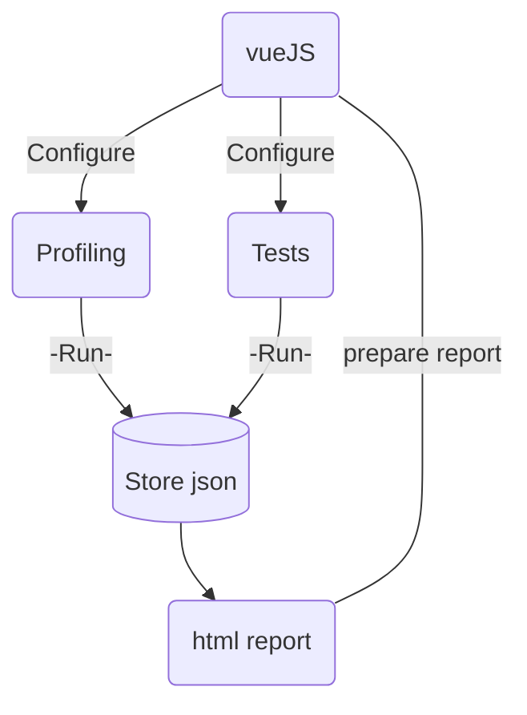

# Gonad
This is a simple project to profile and do Data Quality test of your Enterprice Data Warehouse

It's using the following librarys
- pytest
- pytest BDD
- jinja2
- and probably some more

Everything should be included eighter in the docker image or in the requirements.txt


## Scope
The scope of this project is to provide a simple way to profile and test your data warehouse.
Option to just run the profiling or just the testing is possible.
Generating a html report of the test result.
Profiling and test results is stored in a database and can be used to generate reports in the future.

### Note:
A possible future scope is to provide a way to generate a report of the profiling and test results in a vue.js web app hosted locally.





### Profiling
The profiling part of this project is meant to be a simple way to profile your data warehouse.
The following things are currently supported:
- row count
- data type
- Not null proportion
- Distinct proportion
- Distinct count
- Is unique
- Min
- Max
- Avg


TODO: Add macros to the profiling part
- max length (string) TODO:
- Top n values
- Bottom n values

### Testing
#### Basic tests
The testing part of this project is meant to be a simple way to test your data warehouse.
- Duplicates
    - will query the id and not the key, if scd2 it will query the id and the valid_from
- Orphans
    - will try to identify if there is a record in the fact table that has no corresponding record in the dimension table.
    - if dat vault is target then it will check if there is a record in the sat or link table that has no corresponding record in the hub table.
        - Prerequisite: All hash keys have the same name in all the different entities
- Emty table
    - will test all tables and see that theyr'e not empty.
        - Test for the selected table will fail if empty

#### Logic tests - (Not implemented yet)
- Address
    - will check if the address is in the correct format
    - will check if the address is in the correct country
    - will check if the address is in the correct city
    - will check if the address is in the correct street
- Email
    - will check if the email is valid (pattern matching)
    - will check if the email is in the correct format
- Phone
    - will check if the phone is valid (pattern matching)
    - will check if the phone is in the correct format

#### Business logic tests
- Custom logic could be added to the project


## How to use
Open the project in devcontainer in VSCode, all dependencies should be installed automatically

### Configure
#### Update your profile in the profiles.yaml file

```yaml
project:
    target: your_target
    outputs:
        your_target:
            type: sqlserver
            server: your_server
            port: your_port
            user: your_user
            password: your_password
            database: your_database

```

#### Update the identifier section in the config.yaml file
```yaml

```

### Run the tests


3. Run the following command
```bash
pytest -m "data_mart" -s -v --alluredir=reports
```


## TODO:
Get Allure to work to serve nice looking test reports in a website